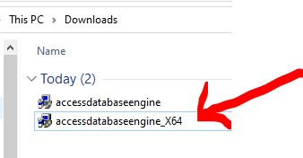
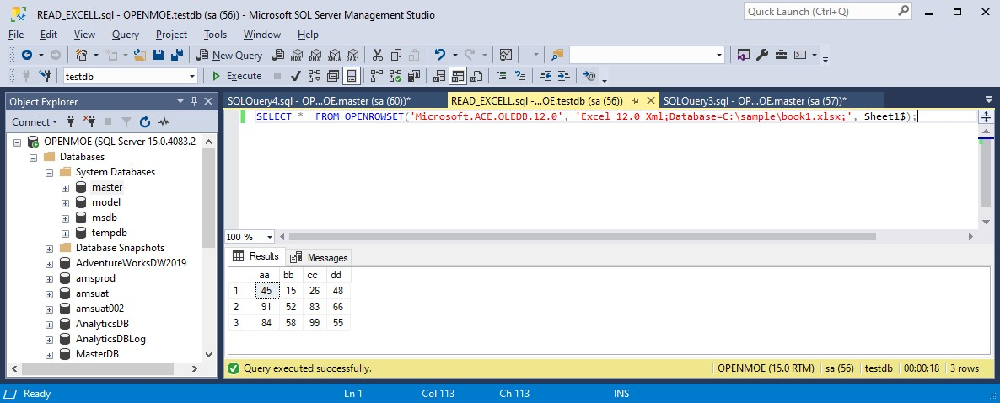
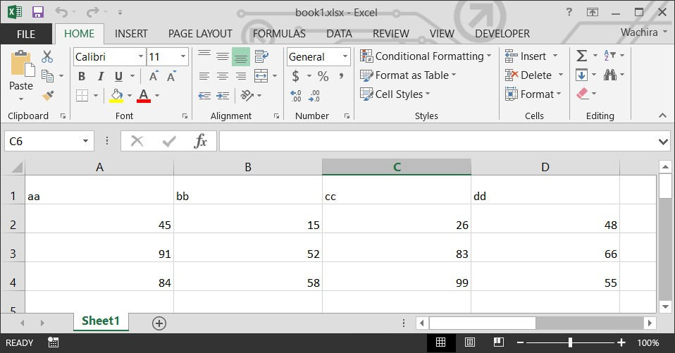

# sqlserver-read-excel
sqlserver read excel

## download extension 

``Microsoft Access Database Engine 2016 Redistributable``

```
https://www.microsoft.com/en-us/download/details.aspx?id=54920
```


## allow extension

```
USE [master] 
GO 

EXEC master.dbo.sp_MSset_oledb_prop N'Microsoft.ACE.OLEDB.12.0', N'AllowInProcess', 1 
GO 

EXEC master.dbo.sp_MSset_oledb_prop N'Microsoft.ACE.OLEDB.12.0', N'DynamicParameters', 1 
GO 

EXEC sp_configure 'show advanced options', 1
RECONFIGURE WITH OVERRIDE
GO

EXEC sp_configure 'ad hoc distributed queries', 1
RECONFIGURE WITH OVERRIDE
GO
```

## command connect

### OPENROWSET

```
SELECT * 
FROM OPENROWSET('Microsoft.ACE.OLEDB.12.0', 'Excel 12.0 Xml;Database=C:\data\simple.xlsx;', Sheet1$);
```

### OPENDATASOURCE

```
SELECT * FROM OPENDATASOURCE('Microsoft.ACE.OLEDB.12.0', 'Data Source=C:\data\simple.xlsx;Extended Properties=EXCEL 12.0')...[Sheet1$];
```



### another

```
SELECT * FROM OPENROWSET(
  'Microsoft.ACE.OLEDB.12.0',
  'Excel 12.0;Database=\\\\FileServer\\ExcelShare\\HRMSDATA.xlsx;HDR=YES;IMEX=1',
  'SELECT * FROM [EMPMASTER$]'
  )
```
## example excell



FROM : 

https://www.mssqltips.com/sqlservertip/6178/read-excel-file-in-sql-server-with-openrowset-or-opendatasource/
